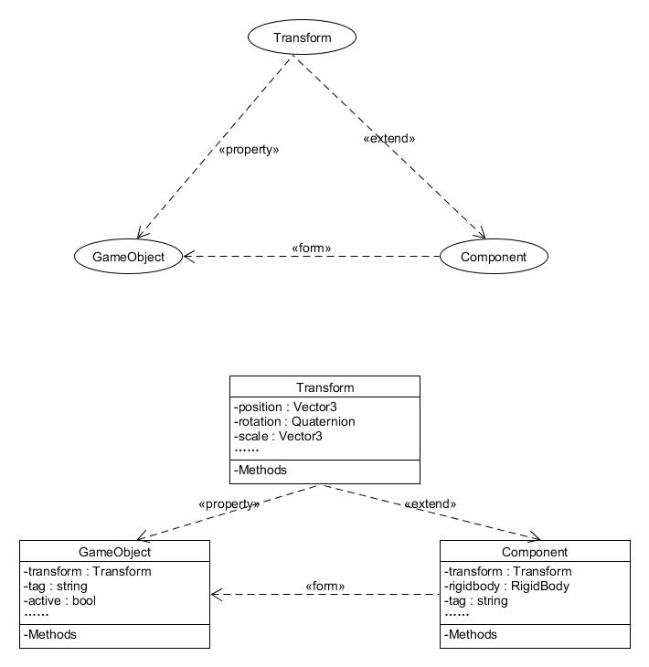

# 简答题

1. 解释 游戏对象（GameObjects） 和 资源（Assets）的区别与联系。
2. 下载几个游戏案例，分别总结资源、对象组织的结构（指资源的目录组织结构与游戏对象树的层次结构）
3. 编写一个代码，使用 debug 语句来验证 MonoBehaviour 基本行为或事件触发的条件
    * 基本行为包括 Awake() Start() Update() FixedUpdate() LateUpdate()
    * 常用事件包括 OnGUI() OnDisable() OnEnable()
4. 查找脚本手册，了解 GameObject，Transform，Component 对象
    * 分别翻译官方对三个对象的描述（Description）
    * 描述下图中 table 对象（实体）的属性、table 的 Transform 的属性、 table 的部件
      * 本题目要求是把可视化图形编程界面与 Unity API 对应起来，当你在 Inspector 面板上每一个内容，应该知道对应 API。
      * 例如：table 的对象是 GameObject，第一个选择框是 activeSelf 属性。
    * 用 UML 图描述 三者的关系（请使用 UMLet 14.1.1 stand-alone版本出图）
5. 整理相关学习资料，编写简单代码验证以下技术的实现：
    * 查找对象
    * 添加子对象
    * 遍历对象树
    * 清除所有子对象
6. 资源预设（Prefabs）与 对象克隆 (clone)
    * 预设（Prefabs）有什么好处？
    * 预设与对象克隆 (clone or copy or Instantiate of Unity Object) 关系？
    * 制作 table 预制，写一段代码将 table 预制资源实例化成游戏对象
7. 尝试解释组合模式（Composite Pattern / 一种设计模式）。使用 BroadcastMessage() 方法
    * 向子对象发送消息

# 个人理解

1. 区别与联系
    * 区别：游戏中的所有对象都是游戏对象，GameObject则是游戏中所有实体Class的基类，相对而资源而言是相对比较抽象的概念。资源则比较具象化。
    * 联系：资源可以作为一个模板被导入使用，也可以被多个对象使用或本身实例化为游戏中的对象，同时资源内部也可以有很多对象。  
2. 根据官方文档以及下载尝试的几个游戏案例，资源种类可以大致分为：模型、动画、材质、着色器、纹理、音频、脚本等。对象则有玩家、环境、对手、摄像机、灯光等虚拟父类。
3. 经查阅官方文档和实践检验，题目所列几个事件和行为的原理及触发条件如下。
    * Awake行为是在脚本实例被加载时即被调用
    * Start行为仅在Update函数第一次被调用前调用
    * Update行为每一帧触发一次
    * FixedUpdate行为是在自设定的帧频下，每一帧触发一次
    * LateUpdate行为是当Behaviour是enabled的情况下，在所有Update函数调用后被调用
    * OnGUI事件是当渲染和处理GUI事件时被调用
    * OnDisable事件是当行为变得无效的时候被调用
    * OnEnable事件是当对象启用并激活的时候被调用

    另外，事件函数一般都以On开头，示例代码如下

    ``` c
    using System.Collections;
    using System.Collections.Generic;
    using UnityEngine;

    public class NewBehaviourScript : MonoBehaviour
    {
        void Awake()
        {
            Debug.Log("Awake");
        }

        // Use this for initialization
        void Start()
        {
            Debug.Log("Start");
        }

        // Update is called once per frame
        void Update()
        {
            Debug.Log("Update");
        }

        void FixedUpdate()
        {
            Debug.Log("FixedUpdate");
        }

        void LateUpdate()
        {
            Debug.Log("LateUpdate");
        }

        void OnGUI()
        {
            Debug.Log("OnGUI");
        }

        void OnDisable()
        {
            Debug.Log("OnDisable");
        }

        void OnEnable()
        {
            Debug.Log("OnEnable");
        }
    }
    ```  
4. 测试样例见test项目
    * 定义
        * GameObject是Unity场景里面所有实体的基类。
        * Transform是用于储存并操控物体的位置、旋转和缩放的类。每一个Transform可以有一个父级，允许分层次应用位置、旋转和缩放。
        * Component是游戏物体一切附加类的基类。比如它是Transform的基类。
    * 关系
        * table的属性有name，tag，layer，active，transform的属性等。
        * transform的属性有position，rotation，scale等。
        * table的部件有transform、cube、box collider、mesh renderer等
    * 三者关系图
    
5. 测试代码在Test.cs中，提取核心内容如下
    * 查找对象
        * 通过名称查找单个对象
        ```c
        public static GameObject Find(string name);
        //找不到则返回null
        ```
        * 通过标签查找单个对象
        ```c
        public static GameObject FindGameObjectWithTag(string tag);
        //找不到则返回null
        ```
        * 通过标签查找多个对象
        ```c
        public static GameObject[] FindGameObjectsWithTag(string tag);
        //找不到则返回空数组
        ```
        * 通过类型查找单个对象
        ``` c
        public static GameObject FindObjectOfType(System.Type type);
        //找不到则返回null
        ```
        * 通过类型查找多个对象
        ``` c
        public static GameObject[] FindObjectsOfType(System.Type type);
        //找不到则返回空数组
        ```
    * 添加子对象
    ``` c
    public static GameObject CreatePrimitive(PrimitiveType type);
    ```
    * 遍历对象树
    ``` c
      foreach(Transform child in transform)
      {
          Debug.Log(child.gameObject);
      }
    ```
    * 清除所有子对象
    ``` c
      foreach(Transform child in transform)
      {
          Destroy(child.gameObject);
      }
    ```
6. 预设
    * 优点：预设可以看成是一个模板，可以将比较容易复用的实体集设成预设，这样以后在重复使用该实体集时就不用再一一使用底层的对象去创建和拼接。
    * 区别与克隆：预设和克隆不同的地方是，预设的每个实例之间是相互关联的，牵一发而动全身，预设的属性一旦改变，其所有实例也会跟着改变，而克隆的个体之间是相互独立的。
    * Table预设实践，见test项目
7. 组合模式
    > 组合模式（Composite Pattern），又叫部分整体模式，是用于把一组相似的对象当作一个单一的对象。组合模式依据树形结构来组合对象，用来表示部分以及整体层次。这种类型的设计模式属于结构型模式，它创建了对象组的树形结构。这种模式创建了一个包含自己对象组的类。该类提供了修改相同对象组的方式。组合模式是将对象组合成树形结构以表示“部分-整体”的层次结构，它使得用户对单个对象和组合对象的使用具有一致性。
    经典案例：系统目录结构，网站导航结构等
    > 优点：组合模式的使用，使得Unity离散引擎灵活、易于扩展；Component强组合于GameObject,使得内存空间管理富有效率，提高了性能。  

    测试：见CompositePattern.cs脚本，该脚本被添加到Table的各个物体中，Table的结构是
    * Cube(main)
      * Cube1
      * Cube2
      * Cube3
      * CUbe4  

    ``` c
    public class CompositePattern : MonoBehaviour {
        void Start () {
            this.BroadcastMessage("Greeting");
        }
        void Greeting()
        {
            print("I'm son");
        }
    }
    ```
    针对一个Table，运行结果是"I'm son"共出现9次，原因是每个Cube自己会触发一次Greeting，共5次；然后Cube(main)还会向下触发，Cube(main)还有4个子对象拥有Greeting行为，每个触发一次于是又有4次，因此共9次。  
    另外，因上题将Table设置为prefab预设，利用脚本创建了25个实例，每实例化一个Table就会出现9次"I'm son"


### ps：实验题为井字棋，效果和原理见录制的视频和相关代码
