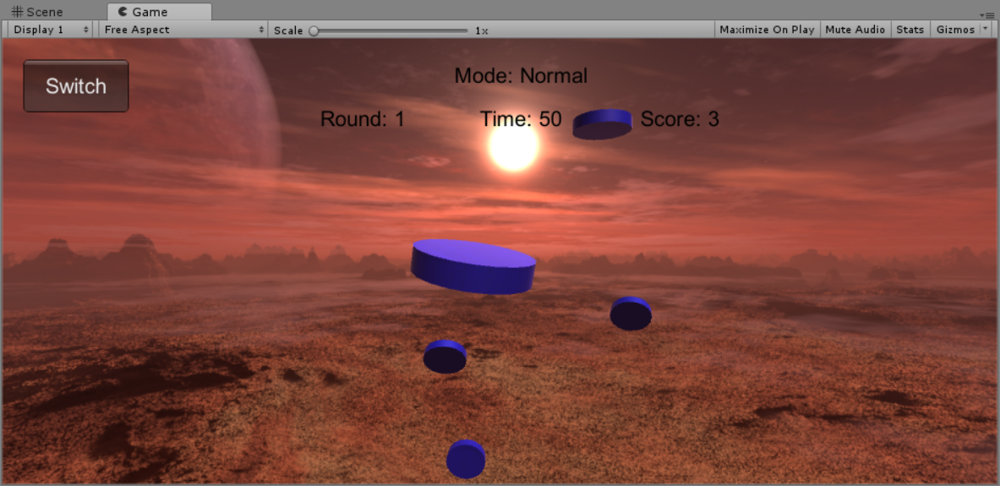
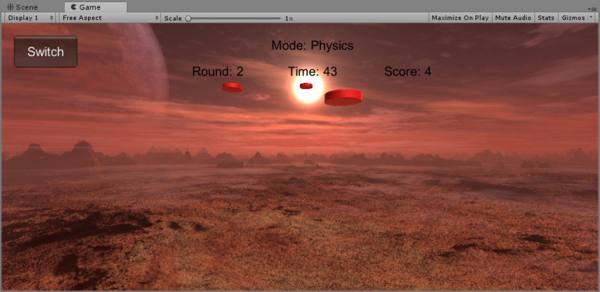
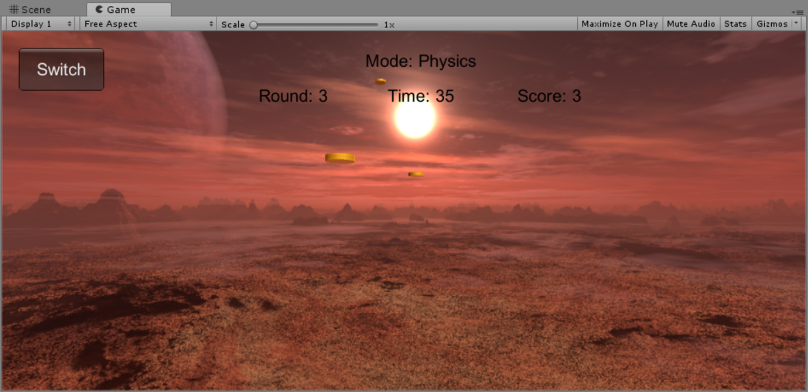
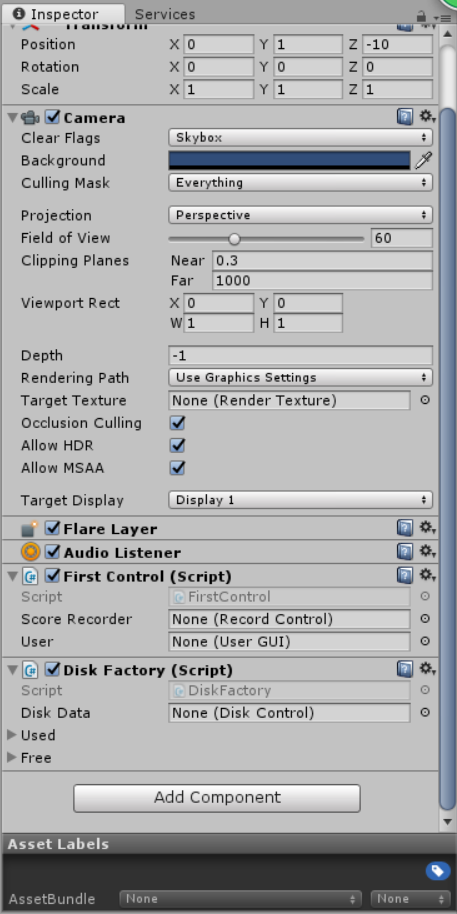

# 打飞碟——基础版和物理版结合
## 游戏简介
打飞碟游戏是一款敏捷类游戏（也可能是我手残），我将游戏规则制定如下：
- 游戏总共3回合，以飞碟颜色区分
- 每个回合难度会增加，主要体现在飞碟速度和大小
- 每关分数独立计算，第一关1个飞碟1分，第2关2分，第三关3分
- 一个飞碟都不能掉才能进入下个回合（手动滑稽）
## 设计模式
1. MVC模式
MVC模式在之前的有关牧师与魔鬼的博客中有详细解释过，这里沿用的是牧师与魔鬼的MVC框架，在此基础上做了一些改动，如果有兴趣可以到我的相关博客查看，这次主要解释下面两个模式。
2. 工厂模式
- 为什么需要工厂模式
游戏对象的创建与销毁成本较高，所以当游戏涉及大量游戏对象的创建与销毁时，必须考虑减少销毁次数，比如这次的打飞碟游戏，或者像其他类型的射击游戏，其中子弹或者中弹对象的创建与销毁是很频繁的。
- 工厂模式的定义
工厂模式是我们最常用的实例化对象模式了，是用工厂方法代替new操作的一种模式。这种类型的设计模式属于创建型模式，它提供了一种创建对象的最佳方式。
- 工厂模式的结构
游戏对象的创建与销毁，分别对应工厂里面的两个List，这两个List分别存放正在使用的游戏对象，已失效的游戏对象。同时保存两个List的目的是，减少游戏对象的创建与销毁的性能开销。如果已失效的List里面还有item，而这时工厂又需要完成一个新的“订单”，便可以从这些回收的item中拿出来再加工（一些逻辑处理），再返回给用户（调用方）。  
- 工厂模式的优缺点
    - 优点 
        - 一个调用者想创建一个对象，只要知道其名称就可以了。 - 扩展性高，如果想增加一个产品，只要扩展一个工厂类就可以。 
        - 屏蔽产品的具体实现，调用者只关心产品的接口。
        - 例子，如果一个客户需要一辆汽车，可以直接从工厂里面提货，而不用去管这辆汽车是怎么做出来的，以及这个汽车里面的具体实现。
    - 缺点
        - 一开始实现会比较复杂，需要用心设计一下工厂的结构
        - 每增加一个产品，可能都需要对工厂进行一次较大的“整改”
        - 如果工厂太大，实时保存的所有游戏对象的开销可能要大于游戏对象直接创建与销毁
- 工厂模式的意义（以本次代码为例）
体现了面向对象设计的核心——抽象、包装、隐藏。道具工厂通过场景单实例，构建了可以被方便获取的disk类。包装了复杂的disk生产和回收逻辑，易于使用。包装了disk的产生规则，有利于应对未来游戏规则的变化，易于维护。
3. 适配器模式
- 为什么需要适配器模式
就像只有一个usb接口的电脑上想要插多个usb外设，就需要通过一个usb适配器来对这些接口进行扩展。在本游戏实例中，由于我们想要继续沿用上次的基础版ActionManager，并且新增一个管理物理运动的PhysicsActionManager，这时在FirstControl里就需要同时有两个变量分别指向这两个动作管理器了。而这样会造成FirstControl需要管理多个功能相同或类似的组件，如果未来还想加多几个动作管理器，就会显得越来越臃肿，可扩展性很差。所以我们希望FirstControl里只保留一个可扩展的变量，那就是适配器！
- 适配器模式的定义
在计算机编程中，适配器模式（有时候也称包装样式或者包装）将一个类的接口适配成用户所期待的。一个适配允许通常因为接口不兼容而不能在一起工作的类工作在一起，做法是将类自己的接口包裹在一个已存在的类中。
- 适配器模式的结构
    - Target：目标抽象类（USB接口）
    - Adapter：适配器类（USB扩展器）
    - Adaptee：适配者类（鼠标、键盘、U盘）
    - Client：客户类（平板电脑）
- 适配器模式的优缺点
    - 优点
        - 可以让任何两个没有关联的类一起运行。 
        - 提高了类的复用。 
        - 增加了类的透明度。 
        - 灵活性好。
    - 缺点  
        - 过多地使用适配器，会让系统非常零乱，不易整体进行把握。
        - 容易误导程序员或用户，比如，明明看到调用的是 A 接口，其实内部被适配成了 B 接口的实现。 
- 适配器模式的意义
适配器的主要作用，就是将多个类接入同一个接口，或者转接“不兼容”接口。有动机地修改一个正常运行的系统的接口，将一个类的接口转换成客户希望的另外一个接口。适配器模式使得原本由于接口不兼容而不能一起工作的那些类可以一起工作。

## 实现效果
- Round1

- Round2

- Round3

## 重要类实现，代码请直接在项目中查看
- 文件框架结构

- 脚本挂载情况

- ActionManager，基础动作管理器
- PhysicsManager，物理动作管理器
- ActionManagerAdapter，适配器类，封装多个动作管理器
- FirstControl，控制第一个场景的类
- DiskFactory，飞碟工厂，管理飞碟的创建和回收

---
## 其他
- 以上多数为个人理解，可能有误，仅供参考。
- 如感兴趣，可访问笔者Gayhub博客地址---[传送门](https://gitgiter.github.io/2018/04/24/Unity3d-hw5-%E6%89%93%E9%A3%9E%E7%A2%9F-%E6%B7%B7%E5%90%88%E7%89%88/)
---