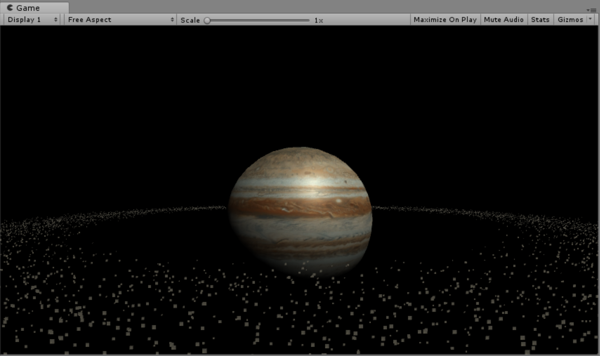
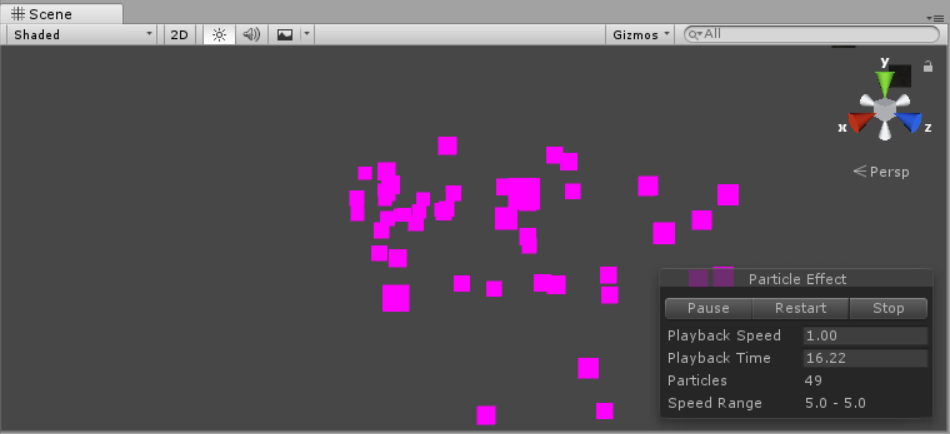
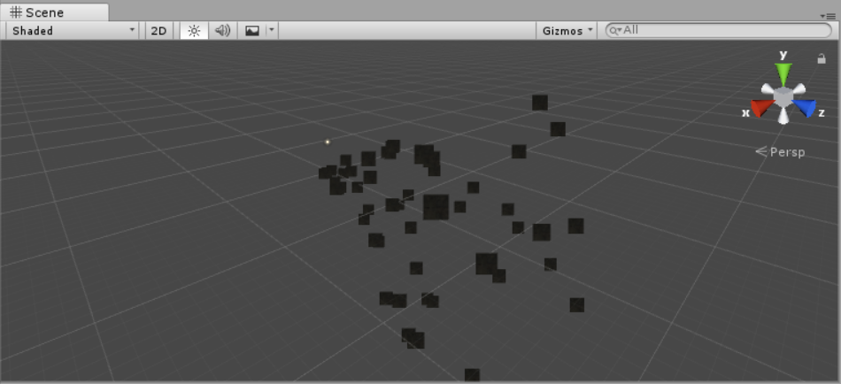
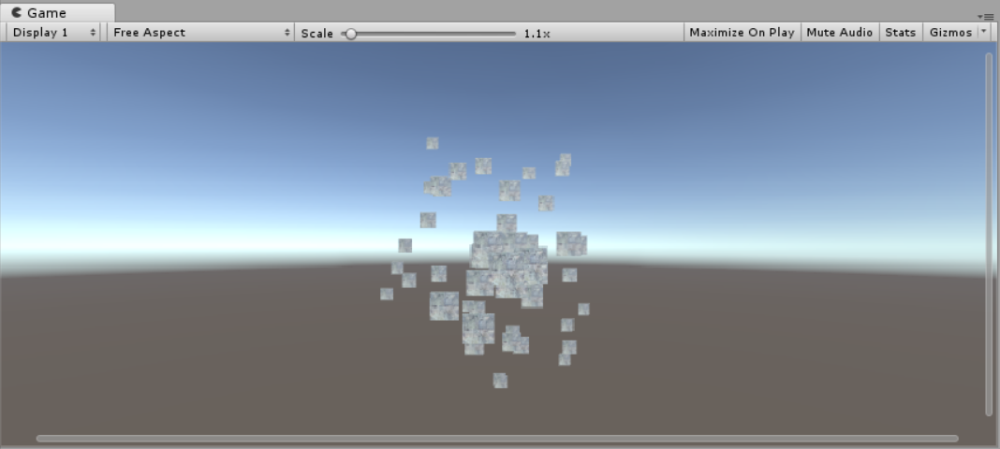
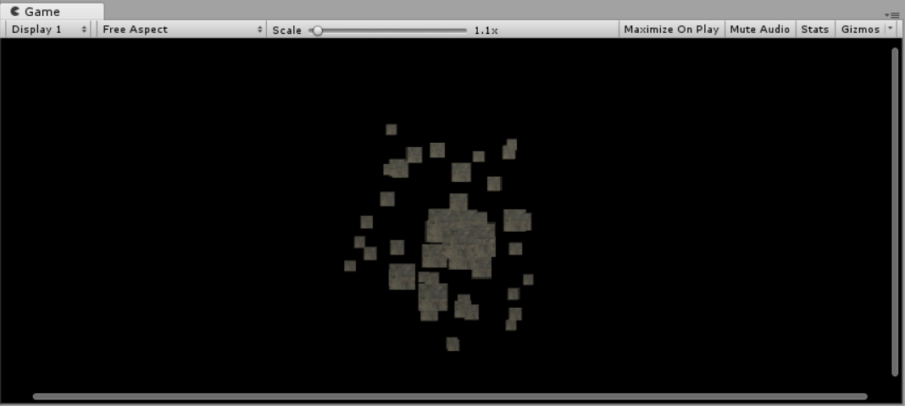
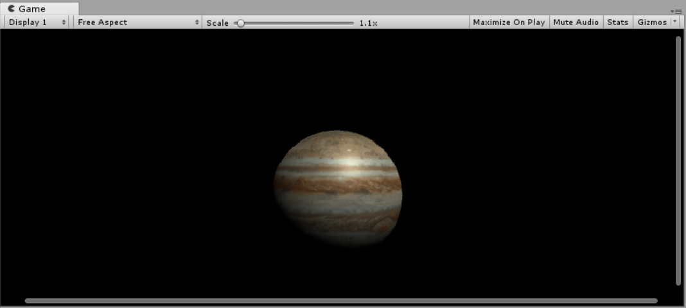
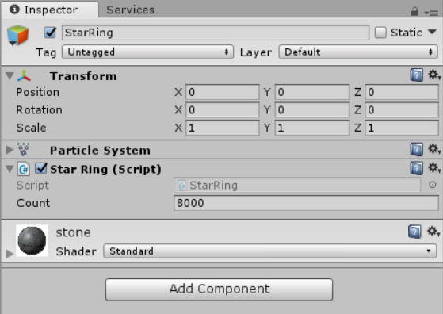
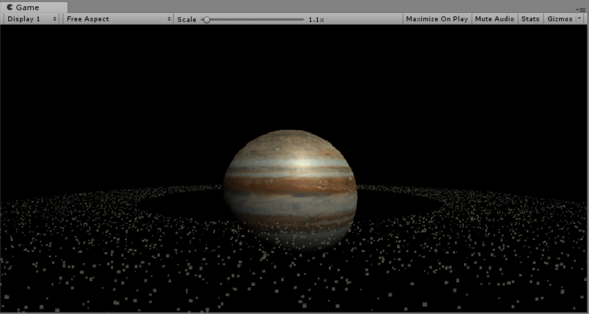
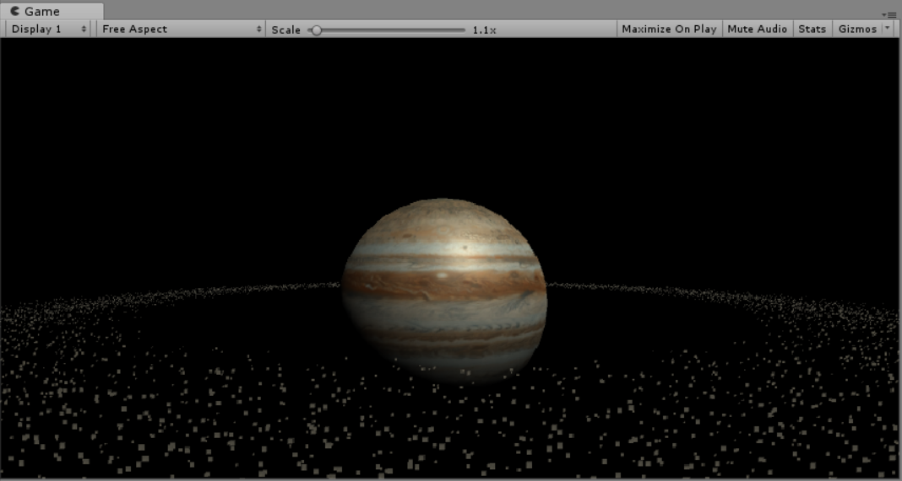

# Unity3d实战之粒子系统
## 选题要求
参考 http://i-remember.fr/en 这类网站，使用粒子流编程控制制作一些效果， 如“粒子光环”

## 实现效果
- 静态图

- 动态图


## 知识准备
粒子系统有许多大模块，比如最常用的有初始化模块、发射模块、粒子群形状模块，颜色随存活时间、速度变化的模块等。这里重点学习了一下最重要的初始化模块中各个参数的作用。
|参数|功能|
|:---:|:---:|
|持续时间（Duration）|粒子系统发射粒子的持续时间|
|循环（Looping）|粒子系统是否循环|
|预热（Prewarm）|当looping开启时，才能启动预热（Prewarm），游戏开始时粒子已经发射了一个周期|
|初始延迟（Start Delay）|粒子系统发射粒子之前的延迟。注意在prewarm（预热）启用下不能使用此项|
|初始生命（Start Lifetime）|以秒为单位，粒子存活数量|
|初始速度（Start Speed）|粒子发射时的速度|
|初始大小（Start Size）|粒子发射时的大小|
|初始旋转（Start Rotation）|粒子发射时的旋转值|
|初始颜色（Start Color）|粒子发射时的颜色|
|重力修改器（Gravity Modifier）|粒子在发射时受到的重力影响|
|继承速度（Inherit Velocity）|控制粒子速率的因素将继承自粒子系统的移动（对于移动中的粒子系统）|
|模拟空间（Simulation Space）|粒子系统在自身坐标系还是世界坐标系|
|唤醒时播放（Play On Awake）|如果启用粒子系统当在创建时，自动开始播放|
|最大粒子数（Max Particles）|粒子发射的最大数量|
## 思路确定
对 http://i-remember.fr/en 上的例子进行了一定的学习后，最后打算做一些改进和创新，利用其原理实现一个卫星带，再用这个卫星带实现一个卫星带围绕行星转的效果。详细过程请见实现步骤。

## 实现步骤
- 第一步，新建一个空对象StarRing，注意将其位置设置成（0，0，0），然后添加一个粒子系统的组件，叫ParticleSystem，组建里面的各种参数先不用改动，**推荐通过代码来修改**，可以批量修改，方便快捷而且有利于团队合作、给别人参考等方面。如果直接在组件里改，其他人每次都需要加载对应的场景才看得到修改的参数，而且粒子系统参数众多，这样也不能很直观地看出修改了哪些参数。因此还是推荐写在代码里。


- 第二步，从上一步可以看出，最开始默认的粒子似乎出现了材质丢失的情况，可能是因为**新老版本材质球不兼容**的原因导致的，也正好，我们可以自己找一些想要的材质，将其拖到承载ParticleSystem的对象上，就完成了对粒子的贴图。我在网上找了一张土壤表面的材质，大致充当一些小卫星的样子（拉近看可能效果没那么好）

- 第三步，为了匹配星空的背景，原来这样的默认背景肯定是不合适的，无法营造出那种效果。因此要将天空盒改成纯黑色的模仿宇宙中的光吞噬。更改步骤是上面菜单栏Window->Lighting->Settings->Skybox Material的材质改成黑色的即可，这里我是改成Defualt Material。


- 第四步，创建一个球体Star，贴上木星贴图，充当大行星，位置设置在（0，0，0），位于粒子群中心，并让其自转，目的是模仿木星环围绕着木星转的情景，这里就没有设置木星的公转了，涉及到镜头跟随等其他一系列操作，不是这次作业的主要重点。

- 第五步，添加一个c#脚本，挂载到Star上，来控制Star的自转。这个代码只需要在update中添加如下代码，即可实现自转，相关原理有在之前的太阳系作业中学习过，这里就算是巩固复习了。
```csharp
this.transform.Rotate(Vector3.up * 30 * Time.deltaTime);
```
- 第六步，添加一个c#脚本，用来挂载到StarRing上，开始主要代码的编写，实现对粒子系统的控制。

- 第七步，为方便起见，创建一个类，来记录每个粒子所应该具有的基本信息。这样有利于提升代码**美观度**，**可读性**，也使得可**扩展性**大大增强，如果往后需要给每个粒子加基本属性信息的话，只需要在类中加一个成员，不用大幅度改动重要代码。
```csharp
public class ParticleInfo
{
    public float radius = 0;
    public float angle = 0;
    public ParticleInfo(float radius, float angle)
    {
        this.radius = radius;   // 半径  
        this.angle = angle;     // 角度  
    }
}
```
- 第八步，确定并添加和粒子系统初始化及管理有关的成员变量。成员变量应该**越简越好**，防止成员冗余造成额外的空间开销。这里其实最重要的就是前面三个成员变量，分别是粒子系统、粒子数组以及粒子信息数组。**粒子系统**就是大Boss，**粒子数组**主要是用来更细致地定义每个粒子的属性，最后可以通过粒子数组来设置粒子系统。而**粒子信息数组**则更多地扮演着一个对每个粒子信息进行统一集成和管理的角色，存储着随机生成的粒子半径和角度，可以用来计算每个粒子的位置，已确定粒子数组中每个元素的position。
```csharp
private ParticleSystem particleSys;  // 粒子系统  
private ParticleSystem.Particle[] particleArr;  // 粒子数组  
private ParticleInfo[] info; // 粒子信息数组  

float speed = 0.25f;            // 速度    
public int count = 8000;       // 粒子数量 
```
- 第九步，初始化粒子系统。主要是要申请两个重要数组，以及设置整个粒子系统的初始速度和最大粒子量。
```csharp
void Start () {
    // 初始化粒子数组  
    particleArr = new ParticleSystem.Particle[count];
    info = new ParticleInfo[count];

    // 初始化粒子系统  
    particleSys = this.GetComponent<ParticleSystem>();
    particleSys.loop = false;              // 取消粒子循环
    particleSys.startSpeed = 0;            // 设置粒子初速度      
    particleSys.maxParticles = count;      // 设置最大粒子量  
    particleSys.Emit(count);               // 发射粒子  
    particleSys.GetParticles(particleArr);

    IniAll();   // 初始化所有粒子
}
```
- 第十步，初始化所有粒子。这里主要随机产生一些粒子的信息，比如粒子半径，角度，大小等。
```csharp
void IniAll()
{                
    for (int i = 0; i < count; ++i)
    {   
        // 随机每个粒子半径，集中于平均半径附近  
        float midRadius = 8.0f;
        float radius = Random.Range(midRadius - 2, midRadius + 2);

        // 随机每个粒子的角度  
        float angle = Random.Range(0, 360);
        // 转换成弧度制
        float radian = angle / 180 * Mathf.PI;

        // 随机每个粒子的大小
        float size = Random.Range(0.01f, 0.03f);

        info[i] = new ParticleInfo(radius, angle);            

        particleArr[i].position = new Vector3(info[i].radius * Mathf.Cos(radian), 0f, info[i].radius * Mathf.Sin(radian));
        particleArr[i].size = size;            
    }
    // 通过初始化好的粒子数组设置粒子系统
    particleSys.SetParticles(particleArr, particleArr.Length);
}
```
- 最后一步！重写update方法，每帧刷新以实现粒子群移动的效果，对i模2是为了是粒子运动效果更加丰富，可以同时有顺时针和逆时针移动的粒子。但是在真实情况中卫星带中的小卫星旋转方向应该都是大致一致的，不然会出大事，这里主要是为了体验一下粒子系统强大运算能力的魅力。
```csharp
void Update()
{
    for (int i = 0; i < count; i++)
    {
        // 除以半径是为了使速度更加多样化
        float rotateSpeed = (speed / info[i].radius) * (i % 10 + 1);

        // 一半粒子顺时针转，一半粒子逆时针转
        if (i % 2 == 0)
        {
            info[i].angle -= rotateSpeed;
        }
        else
        {
            info[i].angle += rotateSpeed;
        }                

        // 保证角度合法
        info[i].angle %= 360.0f;
        // 转换成弧度制
        float radian = info[i].angle * Mathf.PI / 180;     

        particleArr[i].position = new Vector3(info[i].radius * Mathf.Cos(radian), 0f, info[i].radius * Mathf.Sin(radian));
    }
    // 通过粒子数组设置粒子系统
    particleSys.SetParticles(particleArr, particleArr.Length);
}
```
- 经历过之前的所有方法后，我们就可以把代码跑起来了，内心激动，但是一看效果，贼尬，卫星带边缘如此明显，看着极其不自然。

- 于是上网搜了搜柔滑边缘的方法，看到大神是这么处理的。巧妙地使用比例随机来柔滑边缘，一看似乎很有道理，决定参照模仿一下，效果惊人。主要改动如下：
```cpp
void IniAll()
{          
    float minRadius = 6.0f;  // 最小半径  
    float maxRadius = 10.0f; // 最大半径           
    for (int i = 0; i < count; ++i)
    {   
        // 随机每个粒子半径，集中于平均半径附近  
        float midRadius = (maxRadius + minRadius) / 2;
        float minRate = Random.Range(1.0f, midRadius / minRadius);
        float maxRate = Random.Range(midRadius / maxRadius, 1.0f);
        float radius = Random.Range(minRadius * minRate, maxRadius * maxRate);

        ...         
    }
    // 通过初始化好的粒子数组设置粒子系统
    particleSys.SetParticles(particleArr, particleArr.Length);
}
```
改后效果：

- 优化，采用类似的原理，可以让每个粒子在一个很小的位置范围内抖动，让画面更加真实带感，实现方法是在update方法中可以加入一下随机的偏移量。
```csharp
void Update()
{
    for (int i = 0; i < count; i++)
    {
        ...

        // 粒子在半径方向上抖动           
        float offset = Random.Range(-0.01f, 0.01f);  // 偏移范围
        info[i].radius += offset;

        particleArr[i].position = new Vector3(info[i].radius * Mathf.Cos(radian), 0f, info[i].radius * Mathf.Sin(radian));
    }
    // 通过粒子数组设置粒子系统
    particleSys.SetParticles(particleArr, particleArr.Length);
}
```
到此便和一开始展示的效果完全一致了。

---
## 其他
- 以上多数为个人理解，可能有误，仅供参考。
- 本次项目觉得做得最好的模式是MVC，在之前几次的基础上渐渐改进，本次项目分离得比较彻底，耦合度低了许多。
- 如感兴趣，可访问笔者Gayhub博客地址---[传送门](https://gitgiter.github.io/2018/05/28/Unity3d-hw7-%E7%B2%92%E5%AD%90%E7%B3%BB%E7%BB%9F/)
- 视频演示地址---[传送门](https://www.bilibili.com/video/av24039975/)
- csdn博客地址---[传送门]()
---